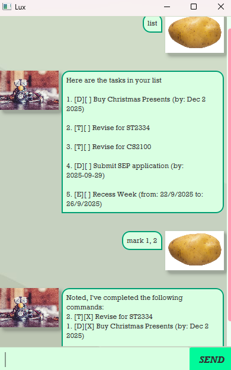

# Lux User Guide

Lux is a CLI-based chatbot that helps you stay productive by managing your To-Do list.
You can create, track, and organize tasks with simple commands.

## Features
Note:
- Commands are case-insensitive (i.e. Bye, bye, BYE) will all cause the program to exit.
- Extraneous parameters for commands that do not take in parameters (such as list and bye) will not be ignored. Please
leave out these extra parameters.
- Mass operations are only supported by Mark, Unmark, and Delete feature and DO NOT work with the find feature.

### Adding Tasks

#### ToDo task
Format: 
> todo TASK_NAME

- Creates a simple ToDo task without a deadline or time range.
- Useful for general reminders.

Example: `todo Buy groceries`

#### Deadline task
Format:
> deadline TASK_NAME /by DATE

- Creates a task with a specific deadline.
- Supported date formats:
  - dd/MM/yyyy → e.g., 29/09/2025 or 29/9/2025
  - yyyy-MM-dd → e.g., 2025-09-29
  - MMM dd yyyy → e.g., Sep 29 2025

Example:
- `deadline Submit report /by 2025-09-29`

#### Event task
Format:
> event TASK_NAME /from START_DATE /to END_DATE

- Creates a task that spans a time range.
- Dates follow the same supported formats as deadlines.
    - dd/MM/yyyy → e.g., 29/09/2025 or 29/9/2025
    - yyyy-MM-dd → e.g., 2025-09-29
    - MMM dd yyyy → e.g., Sep 29 2025

Example:
- `event Conference /from 28/09/2025 /to 30/09/2025`

### Managing Tasks

#### Marking Tasks as complete
Format:
> mark INDEX 
> 
> mark INDEX1, INDEX2, ...

- Marks one or more tasks as completed.
- INDEX refers to the task number shown in list.

Example: 
- `mark 1`
- `mark 2, 3, 4`

#### Ummarking Tasks
Format:
> unmark INDEX 
> 
> unmark INDEX1, INDEX2, ...

- Marks one or more tasks as not completed.
- INDEX refers to the task number shown in list.

Example:
- `unmark 1`
- `unmark 2, 3, 4`

#### Deleting Tasks
Format:
> delete INDEX
>
> delete INDEX1, INDEX2, ...

- Deletes one or more tasks permanently.
- INDEX refers to the task number shown in list.

Example:
- `delete 1`
- `delete 2, 3, 4`

### List All Tasks
Format:
> list

- Displays all tasks with their index, type, status, and details.

### Find Tasks
Format:
> find KEYWORD

- Searches for tasks containing the given keyword in their name.

Example:
- `find groceries`
- 
### Exiting Lux
Format: 
> bye

- Exits and updates save data of task list
- You will need to use this command to ensure that your updates are saved. Otherwise, they will be **permanently lost**